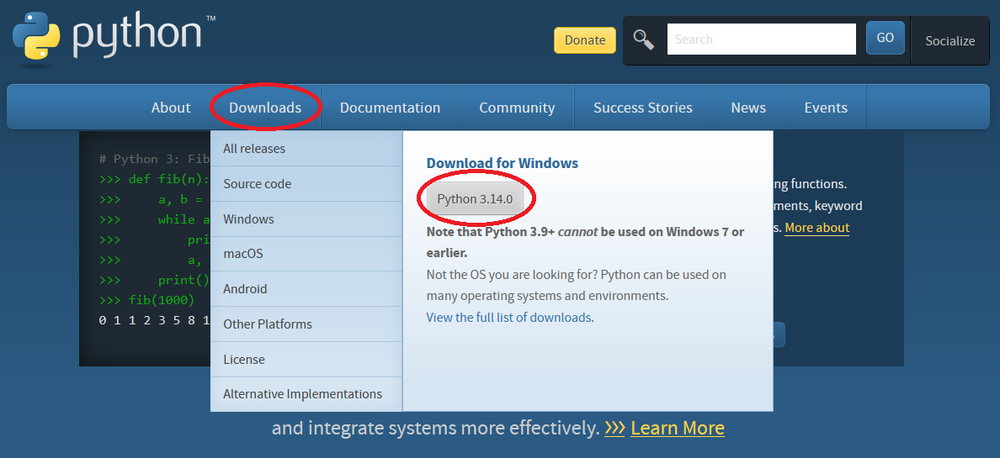

# TinkerCAD to Minecraft
This tool puts TinkerCAD models into Minecraft by replacing blocks using the [objmc](https://github.com/Godlander/objmc) library.

**Disclaimer**: Only tested on Windows!

## Step 1: Install Python
1. Go to https://www.python.org/
2. Download and install Python.


Make sure you check the number one box!

## Step 2: Install Minecraft
1. Go to https://tlauncher.org/
2. Download and install TLauncher.


3. Install version *Official 1.19* and run the game.


## Step 3: Install me
1. Download and unzip (extract) this library.

2. Run *first.py* by double clicking. It will remove itself when it's done (and some unnecessary files too).
3. Go into Minecraft. Main Menu > Options > Resource Packs. Add the *objmc* resource pack inside the game.


## Step 4: Use me!
1. Name your TinkerCAD design properly. Read the [Naming Blocks](#naming-blocks) chapter below.
2. Export your design as OBJ.

3. Place the *zip* file into the *zip* folder.
4. Run *convert.py* by double clicking.
5. Reload the game by pressing ```F3 + H```. You must be playing inside a world first.


## Naming blocks
If you want to replace a block, you must use the name of its ID. The IDs are found in [this spreadsheet](https://docs.google.com/spreadsheets/d/1-Jf8VpmG-V2ytZ0ppAEDtVSaVYEjQ-CYAZMt-eQMNxQ/edit?gid=984941200) (column C).

The name of the TinkerCAD design must match **exactly** the block ID, so do not use capital letters or spaces.

Some block IDs do not work, but most of them do. So, if you find a block that does not work, try with another block, *dirt* and *stone* work, for example.

## Knows issues
* Make sure the models are smaller than 1MB (1024KB). Otherwise, it may crash the game.
* Some files with lots of geometry might miss some faces and therefore, the model might look weirdly unfinished.
* Make sure that no more than 256 colors are used. Error handling and notification is not properly done yet.
* Some Minecraft blocks do not work with this library. I haven't tested them all yet.
* This combination of Minecraft and objmc versions is the only one that I have found to work. An update might come sometime in the future...


## Huge thanks to the *objmc* developers for making this possible!
Check out https://github.com/Godlander/objmc.